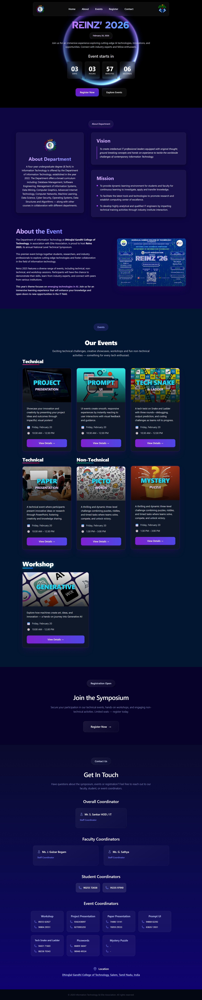

# 🌐 REINZ 2026 — IT Department Symposium Website

A modern and responsive event website for **REINZ 2026**, the annual symposium of the **Information Technology Department**, hosted by **Dhirajlal Gandhi College of Technology (DGCT), Salem, Tamil Nadu**.

This website is designed and developed solely by **Deepak** using **React**, **React-Bits**, and **Tailwind CSS**, providing an elegant, fast, and interactive experience for event participants and visitors

---

## 🚀 Live Demo
🔗 [View Website](https://reinz26.netlify.app)

---

## 🧩 Tech Stack
- ⚛️ **React.js** — Component-based UI
- 🧱 **React-Bits** — Reusable components & UI patterns
- 🎨 **Tailwind CSS** — Utility-first modern styling
- 🌐 **Netlify** — Deployment and hosting

---

## 🏛️ About the Event
**REINZ 2026** is a technical symposium organized by the **Information Technology Department** at DGCT.  
It features multiple technical and non-technical events aimed at encouraging innovation, collaboration, and creativity among students. 

---

## 💡 Features
- 🎫 Event listings and details  
- 🧾 Registration links  
- 🕹️ Interactive UI sections  
- 📅 Event schedule and location info  
- 📱 Fully responsive and fast-loading design  

---

## 📸 Screenshots

---

## 🧑‍💻 Developer
**Deepak**  
Frontend Developer | Java + React Enthusiast  
📧 [deepakn132006@gmail.com](mailto:deepakn132006@gmail.com)  
🌐 [GitHub Profile](https://github.com/Deepak-132006)

---

## 📜 License
This project is created for educational and event publication purposes.  
© 2026 Deepak N. All Rights Reserved.
